<div align="center">

<!-- Animated Header Banner -->


<br/>

<!-- Typing SVG -->
<a href="https://github.com/dota-devy">
  
</a>

</div>

<!-- Divider -->


## `> whoami`

```js
const dotaDevy = {
    location  : "Earth.exe",
    interests : ["Gaming", "Camping", "Security", "Gadgets"],
    mission   : "Making robots do my bidding",
    status    : "Online & compiling dreams",
    collab    : ["Games", "Security Projects"],
};
```

<!-- Divider -->


## `> cat interests.log`

<div align="center">

<table>
<tr>
<td align="center" width="200">
<br/>

<br/><br/>
<b>Gaming</b>
<br/>
<sub>Dota & beyond</sub>
<br/><br/>
</td>
<td align="center" width="200">
<br/>

<br/><br/>
<b>Camping</b>
<br/>
<sub>Touching grass IRL</sub>
<br/><br/>
</td>
<td align="center" width="200">
<br/>

<br/><br/>
<b>Security</b>
<br/>
<sub>Hack the planet</sub>
<br/><br/>
</td>
<td align="center" width="200">
<br/>

<br/><br/>
<b>Robotics</b>
<br/>
<sub>Silicon minions</sub>
<br/><br/>
</td>
</tr>
</table>

</div>

<!-- Divider -->


## `> systemctl status projects`

<div align="center">

```
 STATUS      PROJECT                    PRIORITY
 ────────────────────────────────────────────────
 [ACTIVE]    Robot army recruitment       HIGH
 [ACTIVE]    Security research            HIGH
 [QUEUED]    Game dev collaboration       MEDIUM
 [IDLE]      Gadget tinkering             ONGOING
 [PLANNED]   World domination             ██░░░ 40%
```

</div>

<!-- Divider -->


## `> neofetch --stats`

<div align="center">

<a href="https://github.com/dota-devy">
  
</a>
&nbsp;&nbsp;
<a href="https://github.com/dota-devy">
  
</a>

<br/><br/>

<!-- Streak Stats -->
<a href="https://github.com/dota-devy">
  
</a>

</div>

<!-- Divider -->


## `> ping collaborators`

<div align="center">

Looking to team up on **games** and **security projects**.
<br/>
If you're building something cool, let's talk.

<br/><br/>

[](mailto:github.quickstep443@passinbox.com)

<br/>

<!-- Profile Views -->


</div>

<!-- Divider -->


<div align="center">

```
  ____    ____
 / ___|  / ___|
| |  _  | |  _
| |_| | | |_| |
 \____|  \____|  ood game.

```

<sub>crafted with caffeine and mass pings</sub>

</div>
